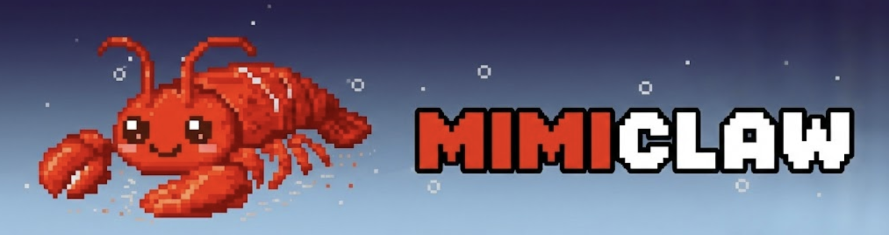

# MimiClaw

<p align="center">
  
</p>

**OpenClaw on a $10 device. Local memory. Privacy-first. No OS.**

MimiClaw is a minimal reimplementation of [OpenClaw](https://github.com/openclaw/openclaw)'s WebSocket gateway control plane, built to run on an ESP32 microcontroller. It replaces the full Node.js stack with bare-metal firmware, bringing personal AI assistant infrastructure to a $10 chip with no operating system required.

## Why

OpenClaw is powerful — multi-channel messaging, agent runtime, tool ecosystem — but it assumes a full computer. MimiClaw strips it down to the core gateway and adds local-first memory, so anyone with a $10 ESP32 can run their own AI assistant hub.

- **$10 total cost** — ESP32 dev board, nothing else
- **No OS** — bare-metal firmware, boots in seconds
- **Local memory** — conversations and context stored as Markdown files on SD card / SPIFFS
- **Privacy-first** — everything stays on your device, no cloud dependency
- **Cross-platform memory sharing** — plug the SD card into any device, your memory travels with you in plain Markdown

## Architecture

```
┌─────────────────────────────────┐
│           ESP32                 │
│                                 │
│  ┌───────────┐  ┌────────────┐  │
│  │ WebSocket │  │  Markdown  │  │
│  │  Gateway  │──│  Memory    │  │
│  │ (Control  │  │  (SPIFFS / │  │
│  │  Plane)   │  │   SD Card) │  │
│  └─────┬─────┘  └────────────┘  │
│        │                        │
│  ┌─────┴─────┐                  │
│  │  Channel   │                 │
│  │  Router    │                 │
│  └─────┬─────┘                  │
└────────┼────────────────────────┘
         │ WiFi
    ┌────┴────┐
    │ Clients │  (CLI / App / Web)
    └─────────┘
```

**Gateway** — WebSocket server on the ESP32, handling session coordination, channel routing, and presence tracking (mirrors OpenClaw's localhost:18789 control plane).

**Memory** — Conversations, context, and agent state persisted as `.md` files. Human-readable, version-controllable, portable across any device.

**Channel Router** — Lightweight message routing between connected clients and upstream AI providers.

## Getting Started

### Hardware

- ESP32 dev board (ESP32-WROOM-32 or similar)
- (Optional) MicroSD card module for expanded memory

### Build & Flash

```bash
# Clone
git clone https://github.com/memovai/mimiclaw.git
cd mimiclaw

# Build with ESP-IDF
idf.py build

# Flash to ESP32
idf.py -p /dev/ttyUSB0 flash monitor
```

### Connect

Once flashed, the ESP32 starts a WebSocket server on its local IP. Connect any OpenClaw-compatible client to `ws://<esp32-ip>:18789`.

## Memory Format

Memory is stored as plain Markdown:

```
memory/
├── sessions/
│   └── 2025-01-15-chat.md
├── context/
│   └── user-preferences.md
└── agents/
    └── default-agent.md
```

Each file is human-readable and editable. Copy the `memory/` folder to any device to carry your full context with you.

## Roadmap

- [ ] Core WebSocket gateway on ESP32
- [ ] SPIFFS-based Markdown memory read/write
- [ ] SD card support for larger memory
- [ ] Basic channel routing (single client)
- [ ] Multi-client session management
- [ ] BLE provisioning for WiFi setup
- [ ] OTA firmware updates

## Compared to OpenClaw

| | OpenClaw | MimiClaw |
|---|---|---|
| Runtime | Node.js | ESP32 bare-metal |
| Cost | Full computer | ~$10 |
| OS | macOS / Linux | None |
| Memory | Database | Markdown files |
| Channels | 15+ platforms | Core gateway |
| Setup | `npm install` | Flash firmware |

## License

MIT

## Acknowledgments

Built on the ideas of [OpenClaw](https://github.com/openclaw/openclaw). MimiClaw is an independent project that reimplements the gateway control plane for embedded hardware.
